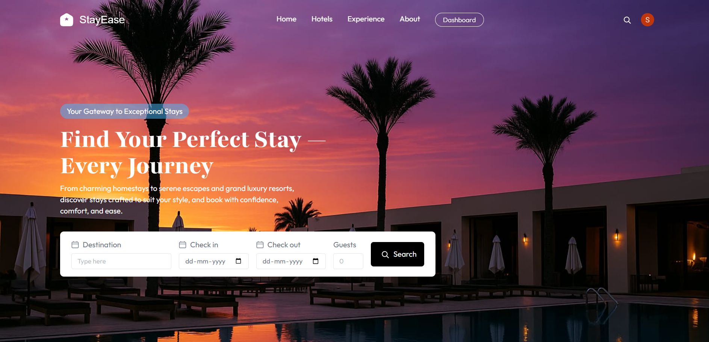
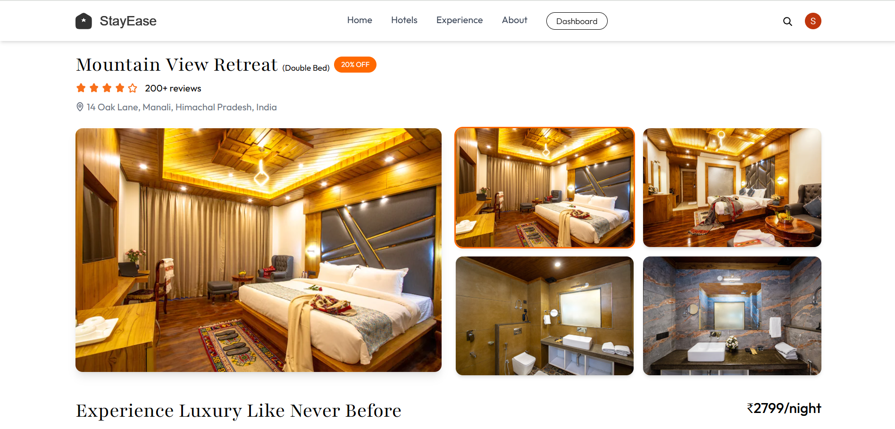
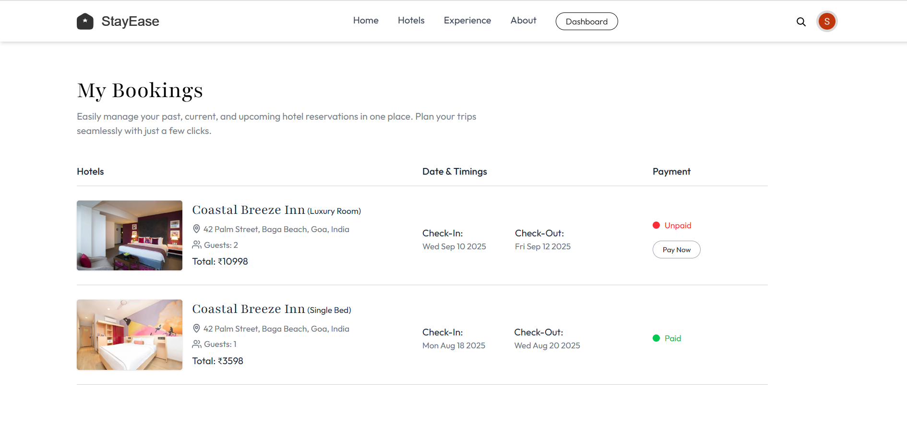

## StayEase 🏨 – Hotel Booking Platform

StayEase is a responsive **full-stack hotel booking platform** that connects **travelers** with **hotel owners**.  
Users can **discover, compare, and book rooms** with ease, while owners can **manage listings, availability, and bookings** from a dedicated dashboard.

---

## 🌐 Live Demo

- **Website:** [stayease-hotel-booking.vercel.app](https://stayease-hotel-booking.vercel.app/)

---

## 📸 Screenshots

- **Landing Page:**

  

- **Room Details:**

  

- **My Bookings:**

  

---

## 🧩 Overview

- **Type:** Full-stack hotel booking web app  
- **Users:** Travelers (Guests) & Hotel Owners  
- **Key Capabilities:** Room browsing, filtering, secure payments, email notifications, owner dashboard

---

## 🛠 Tech Stack

### 💻 Frontend

- **React (Vite)** – Fast, modern frontend tooling  
- **Clerk** – Authentication & role management  
- **Axios + Context API** – Data fetching & global state management  
- **Tailwind CSS** – Utility-first, responsive UI styling  

### 🖥 Backend

- **Node.js + Express** – RESTful API server  
- **MongoDB + Mongoose** – NoSQL database & data models  
- **Stripe** – Secure payments & webhook handling  
- **Cloudinary** – Image upload & storage  
- **Nodemailer** – Email notifications (booking confirmations, etc.)  

---

## 🗂 Project Structure

High-level structure of the project:

```text
hotel-booking/
├── client/                 # Frontend (React + Vite)
│   ├── src/
│   │   ├── assets/         # Images, icons, and static assets
│   │   ├── components/     # Reusable UI components
│   │   │   ├── hotelOwner/ # Components specific to hotel owner dashboard
│   │   ├── context/        # Global state (AppContext)
│   │   ├── pages/          # Application pages (Home, RoomDetails, etc.)
│   │   │   └── hotelOwner/ # Owner pages (Dashboard, AddRoom, ListRoom)
│   │   ├── App.jsx         # Root app component
│   │   └── main.jsx        # React entry point
│   ├── index.html
│   └── vite.config.js
│
├── server/                 # Backend (Node.js + Express)
│   ├── config/             # DB, Cloudinary, Nodemailer config
│   ├── controllers/        # Route controllers (booking, hotel, room, user, webhooks)
│   ├── middleware/         # Auth, upload middleware
│   ├── models/             # Mongoose models (Booking, Hotel, Room, User)
│   ├── routes/             # API routes
│   ├── server.js           # Express app entry point
│   └── vercel.json         # Backend deployment config
│
├── README.md               # Project documentation
└── (other config files)
```

---

## ✨ Core Features

### 👤 User Experience (Travelers)

- **Browse & search hotels/rooms** with filtering and sorting  
- **Detailed room pages** with images, descriptions, and ratings  
- **Secure checkout** via **Stripe** integration  
- **Bookings dashboard** under **"My Bookings"** to track and manage reservations  
- **Instant booking confirmation emails**

### 🏨 Owner Experience (Hotel Owners)

- **Owner dashboard** with booking stats and quick insights  
- **Create & manage room listings** (details, images, pricing, etc.)  
- **Toggle room availability** in real-time  
- **View and manage bookings** for their properties  

### 🔐 Authentication & Security

- **Clerk-powered auth** for sign-in/sign-up  
- **Role-based access control:** `User` vs `Owner`  
- **Protected routes & secure APIs** with **JWT validation** on the backend  

---

## 🚀 Getting Started

### ✅ Prerequisites

Make sure you have:

- **Node.js** v16+  
- **MongoDB** instance (local or cloud, e.g. MongoDB Atlas)  
- **Cloudinary** account (for image uploads)  
- **Clerk** project (for authentication)  
- **Stripe** account (for payments)

---

## 📦 Installation

### 1. Clone the Repository

    git clone https://github.com/SahityaNaik/StayEase-Hotel-Booking-Website.git
    cd StayEase-Hotel-Booking-Website

### 2. Install Client Dependencies

    cd client
    npm install

### 3. Install Server Dependencies

    cd ../server
    npm install

---

## 🔐 Environment Variables

Create a `.env` file inside the **`server`** folder and add:

    MONGO_URI=your_mongodb_uri
    CLERK_SECRET_KEY=your_clerk_secret
    STRIPE_SECRET_KEY=your_stripe_secret

    CLOUDINARY_CLOUD_NAME=your_cloudinary_name
    CLOUDINARY_API_KEY=your_cloudinary_key
    CLOUDINARY_API_SECRET=your_cloudinary_secret

    EMAIL_USER=your_email
    EMAIL_PASS=your_email_password

---

## 🏃 Running the Project

### Run the Client

    cd client
    npm run dev

### Run the Server

    cd ../server
    npm run dev

The client will typically run on something like **`http://localhost:5173`** and the server on **`http://localhost:5000`** (depending on your configuration).

---
